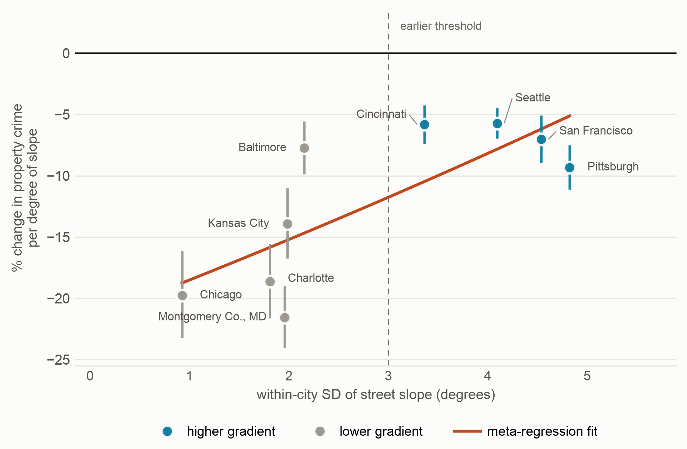
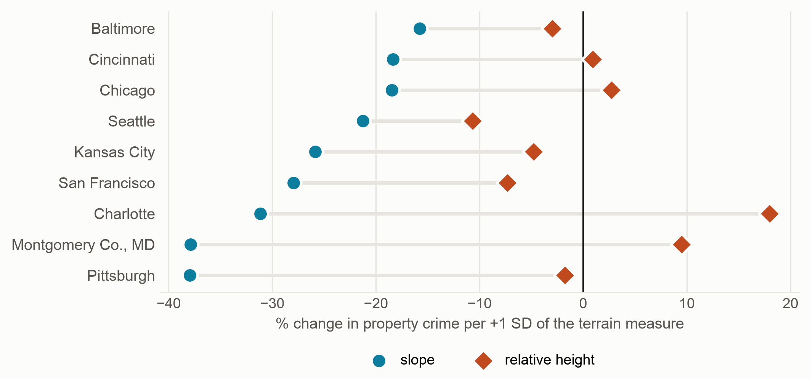
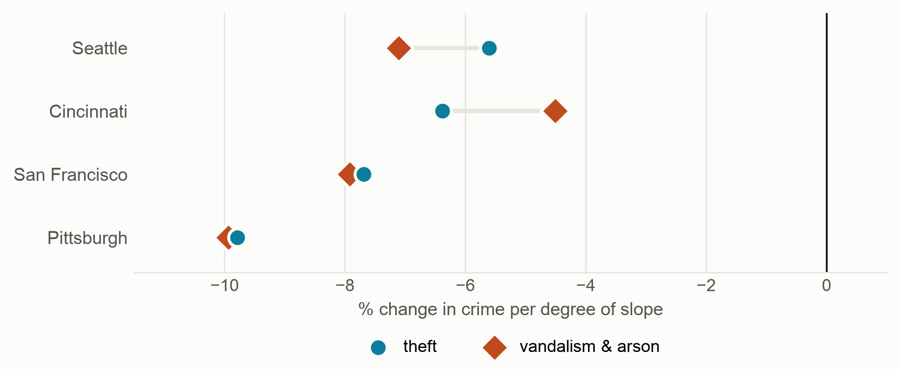
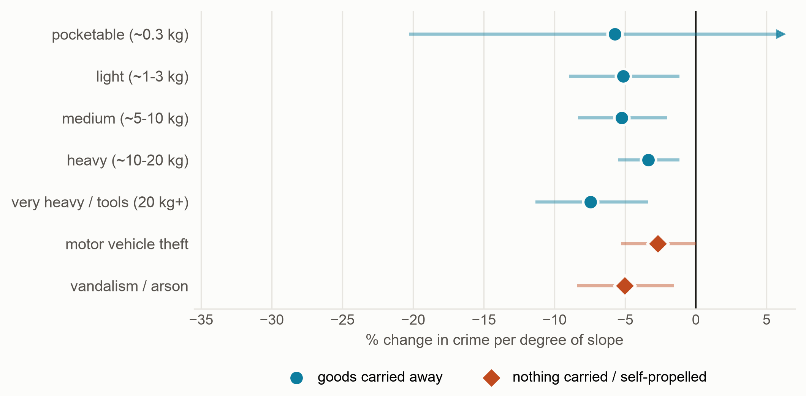
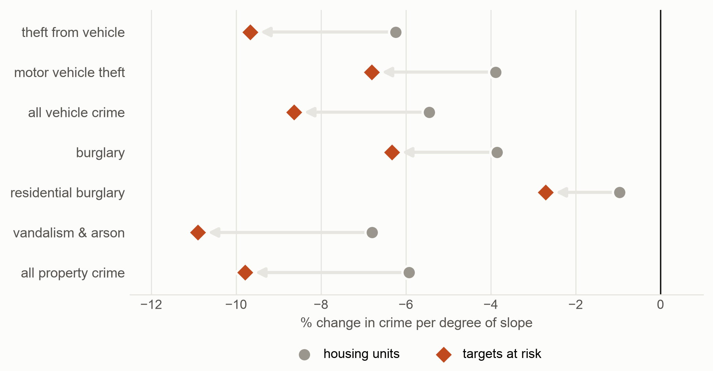

# Slope Deters Property Crime, But Not Because Climbing Is Hard

*Draft manuscript. Target: PLOS ONE. Analysis code, pre-registration, and data pipeline accompany.*

---

## Abstract

Steeper streets carry less crime. Haberman and Kelsay (2021) established this for robbery in
Cincinnati, estimating roughly 4.5% fewer robberies per 1% increase in street-block slope,
and concluded that steep blocks may deter offenders because they raise physical costs, are
hard to escape from, or carry less foot traffic. They did not test between those three
explanations, and no subsequent study has. We do.

Using incident-level property crime from nine US cities, USGS lidar elevation,
building-footprint exposure denominators, and census block-group fixed effects, we report
three findings. **First, the slope effect generalises from robbery to property crime and is
robust in sign but not in magnitude.** Every one of nine cities shows significantly less
property crime on steeper streets. Among the four with genuine gradient the pooled estimate
is **−6.61% per degree of slope (95% CI [−7.39, −5.82])**, close to Haberman and Kelsay's
robbery estimate of −7.72% per degree, but the between-city heterogeneity is
substantial (I² = 0.74) and we caution against treating the coefficient as a constant. **Second, the
effect is not offender effort.** We introduce a control the literature has not used:
vandalism and arson, crimes in which nothing is carried away. These hold approach effort
constant while setting removal effort to zero, so an effort account requires them to be
markedly less deterred. They are not — and where a difference is detectable it runs the
wrong way, with vandalism deterred slightly *more* than theft, which no energetic account
permits. There is no gradient across an ordered ladder of loot mass, motor vehicle theft is
the least deterred category of all, and a directional round-trip cost model predicting sign
reversal for heavy goods is unsupported. **Third, street-network structure absorbs only about a
quarter of the effect** (pooled attenuation 24% against a pre-registered 40% threshold), and
the visibility channel could not be tested because a bare-earth viewshed proxy is collinear
with terrain itself. **Fourth, the effect is not an artifact of target
availability** — the objection we judged strongest. Replacing the housing denominator with
counts of the actual targets at risk (on-street parking capacity, front doors) does not
shrink the effect; it roughly doubles it, and the conventional denominator turns out to have
been attenuating it. All three mechanisms Haberman and Kelsay proposed therefore fail, as
does ours. We report a large, consistent, well-identified association whose mechanism remains
unexplained, and decline to supply a fifth story we cannot test. We close with measurement results that bear on how this literature
should be conducted: cities with under about 3° of within-city slope variation return roughly
twice the per-degree effect and should be excluded; per-degree coefficients are attenuated by coarse
elevation grids, so 10 m estimates like ours understate the association and are not
comparable across studies using different resolutions; and offense-text classifiers require
hand-coded validation, ours having silently destroyed two analysis classes before audit.

---
## 1. Introduction

Environmental criminology holds that offenders are effort-minimising: they offend within
their awareness space and travel no further than necessary. This principle of least effort
underwrites distance decay in the journey to crime, among the field's most robust
regularities. Terrain is an obvious application — if horizontal distance costs effort,
gradient should cost more.

A small literature has looked, and it does not agree with itself:

- **Breetzke (2012)**, Tshwane. Burglary falls with altitude; **slope has no effect.**
- **Haberman & Kelsay (2021)**, *Journal of Quantitative Criminology* 37:625–645. Cincinnati
  street blocks, negative binomial. **Slope matters for robbery** — roughly 4.5% fewer
  robberies per 1% increase in block slope, per foot of block length — while betweenness
  raises it.
- **Kim & Wo (2023)**, San Francisco street segments. Elevation *differences within the
  surrounding quarter mile* predict lower crime more strongly than a segment's own elevation
  or slope.
- A 2026 study finds elevation and hilliness negatively associated with bicycle theft.

Haberman and Kelsay state the open question precisely. Steeper blocks, they conclude, may
have fewer robberies because they **make the physical costs of offending too high**, because
they are **too difficult to escape from**, and/or because they **provide fewer opportunities
owing to lower usage**. Three mechanisms, one observed sign, no test between them:

- **M1, effort.** Climbing and hauling cost energy; offenders substitute to easier targets.
- **M2, exposure and risk.** Steep streets carry less through-traffic, offer fewer escape
  routes, and are overlooked. Fewer offenders pass by; those who do are more exposed.
- **M3, confounded affluence.** Terrain is capitalised into land value; wealth predicts
  guardianship and target hardening.

This paper takes up that question directly. We ask whether the finding generalises from
robbery in one city to property crime across many, and we build a design in which the three
mechanisms make different predictions. The generalisation largely holds. None of the three
mechanisms survives.

## 2. The no-loot control

Vandalism and arson are property crimes in which the offender removes nothing. Reaching the
target costs what it costs a burglar; leaving costs nothing extra.

This makes them a within-design placebo for the removal channel. Under M1 the terrain
coefficient for no-loot crime must be markedly closer to zero than for theft, because the
loaded return leg — half the energetic penalty — is absent by construction. Under M2 and M3
the two should be similar, because through-traffic, visibility, escape routes, and affluence
are indifferent to whether anything was taken.

The comparison is internal: same city, same block groups, same covariates, same terrain
measure. It requires no data beyond a crime-type split, and — as §4.5 shows — it is robust
to measurement error large enough to halve the headline estimate.

## 3. Data and methods

**Crime.** Incident-level records with point coordinates from municipal open-data portals,
2018 onward. Description fields are selected by *rank* rather than by dataset order — an
offense description outranks a weapon, premises, victim or case-status field — because
several portals list ancillary description columns first. Los Angeles was initially absent
from this study for exactly that reason. Offense text is mapped to an ordered loot-mass ladder (pocketable ~0.3 kg →
very heavy/tools ~25 kg), plus `MVT` (motor vehicle theft, where the goods self-propel) and
`NO_LOOT` (vandalism, criminal damage, arson). The mapping was fixed before any outcome
analysis.

**Elevation.** USGS 3DEP, 10 m, bare earth, NAVD88, at uniform resolution across cities.

**Terrain measures.** Slope by Horn's method. Relative height as Topographic Position Index
— elevation minus the mean within radius R (Weiss 2001) — at R ∈ {50…2000} m, computed by
FFT convolution with a matched convolution of the validity mask so coastlines are compared
against surrounding land rather than implicit zeros.

**Units.** Street segments (San Francisco, from OpenStreetMap) and 100 m grid cells (all
cities). Segments are the confirmatory unit and the only one on which network measures are
defined.

**Exposure.** Census housing units and population apportioned by **residential building
footprint area**, not by land area.

**Model.** Poisson pseudo-maximum-likelihood with log-exposure offset, **absorbed census
block-group fixed effects**, and standard errors clustered on block group. Identification is
always within neighbourhood — the top of a hill against the bottom of the same hill.

**Inclusion.** Fixed in advance (`PREREGISTRATION.md` §4) on terrain and volume only:
TPI SD ≥ 4 m, ≥ 20,000 incidents, ≥ 1.0 incident per unit.

**The paired test.** Theft and no-loot coefficients are estimated on the same units and are
therefore correlated; comparing their confidence intervals for overlap would be invalid. We
bootstrap the difference directly, resampling whole block groups and refitting both models
within each draw.

## 4. Results

### 4.1 The slope effect generalises — robust in sign, heterogeneous in magnitude

Every one of nine cities shows significantly less property crime on steeper streets, but the
per-degree magnitude splits sharply on how much gradient a city actually has:

| City | Slope SD | Effect per degree | 95% CI | |
|---|---:|---:|---|---|
| Pittsburgh | 4.82° | −9.32% | [−11.11, −7.49] | above floor |
| San Francisco | 4.54° | −7.02% | [−8.94, −5.06] | above floor |
| Seattle | 4.10° | −5.73% | [−6.96, −4.47] | above floor |
| Cincinnati | 3.36° | −5.83% | [−7.38, −4.25] | above floor |
| **Pooled above floor** | | **−6.61%** | **[−7.39, −5.82]**, I² = 0.74 | |
| Baltimore | 2.15° | −7.74% | [−9.86, −5.57] | below |
| Kansas City | 1.98° | −13.93% | [−16.74, −11.02] | below |
| Montgomery County MD | 1.96° | −21.55% | [−24.05, −18.97] | below |
| Charlotte | 1.81° | −18.64% | [−21.63, −15.53] | below |
| Chicago | 0.93° | −19.76% | [−23.30, −16.18] | below |
| **Pooled below floor** | | **−14.55%** | | I² = 0.95 |

**Comparison to the prior estimate.** Haberman and Kelsay report approximately 4.5% fewer
robberies per 1% increase in street-block slope, with slope measured as percent grade. One
degree of angle is tan(1°) = 1.746% grade, so under a log link their coefficient converts to
**−7.72% per degree** (β = ln(0.955) × 1.746 = −0.0804). That sits inside the range we find
for property crime among cities with real gradient (−5.73% to −9.32%) and close to our pooled
−6.61%. A different crime type, city, decade and estimator landing in the same band is
meaningful external validation of the magnitude.

Two qualifications. Their outcome is robberies *per foot of block length* rather than per
target at risk, so the estimands are not identical. And we were unable to obtain the full
text — the journal is paywalled and the repository copy returns 403 — so the effect size,
the percent-grade units and the three proposed mechanisms are taken from the published
abstract and secondary summaries. **The conversion above should be confirmed against the
original before publication**, and we flag it rather than presenting it as verified.

**But it is not a constant, and we say so.** An earlier version of this analysis, run on
three cities, found I² = 0.00 and we were tempted to report a constant. Adding Pittsburgh —
a city that played no part in selecting either the variable or the inclusion rule — moved
heterogeneity to **I² = 0.74 (Q = 11.4 on 3 df, p = 0.010)**. With three studies a Q test has
two degrees of freedom and almost no power; I² = 0.00 there meant "undetectable", not
"absent". We report the pooled figure with its heterogeneity attached and caution against
treating −6.6% per degree as a transportable coefficient.

**The gradient floor holds, with one exception worth naming.** The 3° floor was set on the
original six cities. Pooled, the two groups are **−6.61% above versus −14.55% below**, and
the sub-floor group is wildly heterogeneous (I² = 0.95 against 0.74). Charlotte (1.81°)
arrived out-of-sample, fell below the floor, and returned −18.64%, exactly as predicted.
Below roughly 3° a bare-earth elevation model is measuring crowned roadbeds, embankments,
railway grades and ravine edges, all of which track land use rather than terrain.

**Baltimore is the exception.** At 2.15° it sits below the floor but returns −7.74%, inside
the above-floor band. We report this rather than adjusting the threshold to exclude it: the
floor is a rule about measurement reliability, not a claim that every sub-floor city must be
inflated, and a criterion tuned until no city contradicts it would be worthless. Baltimore
weakens the separation; it does not remove it.

We note one honest complication. If the inflation were purely measurement error, the
per-degree effect should decline monotonically with available gradient. It does not:
**Pittsburgh has the most gradient of any city here and the largest above-floor effect.**
The pattern is a floor effect, not a smooth trend, and genuine between-city heterogeneity
above the floor remains unexplained.

### 4.2 Relative height is the unreliable measure

Standardised within city, slope predicts less property crime everywhere. Relative height —
the Topographic Position Index, the measure Kim and Wo emphasise — does not: it ranges from
−10.7% in Seattle to +9.5% in Montgomery County and changes sign. In San Francisco it also
depends on the unit of analysis, giving −9.2% at 100 m cells and +0.1% at street segments,
while slope is negative under both. Where the two measures disagree, slope is the one that
replicates.

### 4.3 The effect is not offender effort (H1, H2)

Under an effort account, crimes that remove nothing must be markedly *less* deterred than
theft, because the loaded return leg is absent. The data do not show that, and where a
difference is detectable it runs the wrong way.

**Slope-floor panel** — all four cities with genuine gradient, per degree of slope:

| City | Theft | Vandalism / arson | Difference | 95% CI | |
|---|---:|---:|---:|---|---|
| Pittsburgh | −9.79% | −9.94% | +0.0017 | [−0.017, +0.021] | indistinguishable |
| San Francisco | −7.69% | −7.92% | +0.0025 | [−0.016, +0.020] | indistinguishable |
| Cincinnati | −6.38% | −4.51% | −0.0198 | [−0.040, −0.002] | theft more deterred |
| Seattle | −5.61% | −7.10% | +0.0160 | [+0.005, +0.027] | vandalism more deterred |

Pooled difference **+0.55 percentage points per degree, 95% CI [−0.22, +1.32]** — containing
zero. Under the pre-registered decision rule (§7 of the analysis plan: indistinguishable in
at least half the cities, with a pooled interval spanning zero) **H1 is falsified and the
effort mechanism is rejected.**

The pattern beneath the pooled figure is what makes this decisive rather than merely
underpowered. An effort account requires theft to be more deterred than vandalism in *every*
city, because only theft carries the loaded return leg. Theft is more deterred in **one city
of four**. The two individually significant deviations point in **opposite directions** —
Cincinnati with theft more deterred, Seattle with vandalism more deterred — which is the
signature of noise, not of a mechanism. And in Pittsburgh and San Francisco, the two cities
with the steepest terrain and therefore the most statistical leverage, the two coefficients
are nearly identical (−9.79 vs −9.94; −7.69 vs −7.92).

Cincinnati enters this test for the first time here. It was previously excluded for having
only 463 vandalism records, which turned out to be a classifier defect rather than a data
limitation: Ohio charges the offense as "CRIMINAL DAMAGING/ENDANGERING", which our pattern
for "criminal damage" did not match, costing 28,513 records. See §6.

Nor is there a gradient with the weight removed (San Francisco segments, per SD of slope):
pocketable −15.4%, light −14.0%, medium −14.2%, heavy −9.3%, very heavy −19.8%. Vandalism,
which carries nothing, sits mid-pack at −13.7%. **Motor vehicle theft, whose "loot" drives
itself away and therefore carries no gradient penalty at all, is the least deterred of every
category at −7.5%** — the opposite of the M1 prediction that it should be least affected
only because its removal is costless, and consistent instead with vehicles being the one
target class whose exposure our denominator systematically misstates (§5).

### 4.4 A stronger version of the effort theory also fails

Because metabolic cost is asymmetric in gradient, a hilltop is expensive to approach but
cheap to leave *carrying goods*, while a hollow is the reverse. The two legs therefore price
a hill in opposite directions, with the balance set by loot mass — predicting that the
terrain coefficient should rise, and possibly reverse sign, as goods get heavier. We built
the directional round-trip cost surfaces (Minetti/Herzog metabolic costs, load-scaled, over
a ring-and-spoke quadrature of the catchment) and tested it. Slope of the coefficient on
loot mass: **−0.0018 per kg, 95% CI [−0.010, +0.018]**.

We also report why this cannot be rescued with more data. Approach cost and loaded-escape
cost are both functions of the same gradient field and correlate at r = −0.80 with relative
height. **Directional movement costs are not identifiable from an elevation raster.**
Separating them requires an asymmetric network — stairways, one-way access, walls.

### 4.5 Network structure absorbs some of the effect, but not enough (H3)

If steep streets deterred offenders by stranding them or by carrying fewer passers-by — two
of the three mechanisms Haberman and Kelsay proposed — then measures of street-network
structure should absorb much of the slope coefficient. We test this on street segments in all
four qualifying cities, adding betweenness, intersection density, permeability, egress count
and walk/drive ratio to the specification.

| City | Slope effect | + network mediators | Attenuation | n segments |
|---|---:|---:|---:|---:|
| Seattle | −10.51% | −9.49% | +10.2% | 21,087 |
| Pittsburgh | −6.23% | −4.27% | +32.2% | 9,657 |
| San Francisco | −4.57% | −5.32% | −16.8% | 11,185 |
| Cincinnati | −1.96% | +1.22% | +38.6% | 7,787 |
| **Pooled** | **−6.51%** | **−4.96%** | **+24.4%** | |

**Pooled attenuation is 24%, against a pre-registered threshold of 40% for supporting M2.**
The mechanism is therefore rejected on our stated rule, but this is a partial rather than a
clean null and we do not overstate it: network structure plausibly carries roughly a quarter
of the association, and the direction is inconsistent across cities — San Francisco's
coefficient *strengthens* under the controls while Cincinnati's largest attenuation comes off
a segment-level baseline of only −1.96%, small enough that the ratio is unstable.

Cincinnati's weak segment-level estimate has an identifiable cause rather than being a
substantive finding. Its department jitters incident coordinates — 99.9% of points are
distinct — giving a **median snap distance of 24.6 m** against 0.7 m in Seattle and 2.6 m in
Pittsburgh. Against a 107 m median block face, a substantial share of incidents land on a
*neighbouring* segment and 14.6% miss the 60 m matching threshold entirely. This is
classical attenuation from location error, it is specific to segment-level work, and
Cincinnati's grid-level estimate (−5.83%) is unaffected. Its segment-level coefficients
should be read as a lower bound.

Two notes on the mediators. First, **distance-weighted betweenness is confounded with the
treatment**: in San Francisco its top-ranked streets are residential lanes over the Twin
Peaks ridge, because terrain forces every cross-town path through them. We therefore weight
paths by travel time, under which the top-ranked streets are the freeways and arterials (Oak,
19th Avenue, Bush, Fell, Market, Van Ness); the two orderings correlate at only ρ = 0.68.
Second, a bare-earth **viewshed proxy is near-collinear with relative height** (r = 0.80) and
cannot be entered as a mediator at all — testing the visibility channel requires building
heights, not terrain. **The visibility mechanism is therefore untested here**, which we state
plainly rather than counting it among the rejected.

### 4.6 The contrast survives a denominator error that halves the level

Apportioning census housing units to analysis units by **land area** — the conventional
choice — assumes development is uniform within a block group. In Montgomery County, 48% of
100 m cells contain no building at all yet were assigned residents, and the resulting error
is itself correlated with terrain (r = +0.27). In dense San Francisco that correlation is
+0.006.

Replacing area apportionment with residential building-footprint apportionment:

| | Montgomery County MD | San Francisco |
|---|---:|---:|
| Area-apportioned | +20.7% | −9.2% |
| Building-apportioned | **+9.5%** | **−7.3%** |

More than half of Montgomery County's apparent positive relative-height effect was a
denominator artifact. And the contrast that carries our argument barely moves:

| Montgomery County MD | Theft | No-loot | Gap |
|---|---:|---:|---:|
| Area-apportioned | +21.7% | +18.0% | +3.65 pp |
| Building-apportioned | +10.1% | +9.5% | **+0.59 pp** |

**A measurement error large enough to halve the headline estimate leaves the
theft-versus-no-loot contrast intact, and makes it more null.** This is the central
methodological advantage of an internal comparison.

### 4.7 The target-availability explanation is refuted

The most serious alternative to a behavioural account is that the effect is **definitional**:
steep streets hold fewer parked vehicles, fewer curb cuts and fewer accessible front doors
per unit of measured housing, so they present fewer targets per unit of nominal exposure.
Motor vehicle theft being the least deterred category is consistent with exactly that, since
vehicles are the target class a housing denominator misstates most badly.

**The objection fails before any crime model is fitted.** Regressing target counts on slope,
with the same housing offset, fixed effects and controls used throughout, shows that steep
San Francisco streets present *more* targets per unit of measured housing exposure, not
fewer:

| Target | % more per +1° of slope | 95% CI |
|---|---:|---|
| On-street parking spaces | **+2.16%** | [+1.55, +2.77] |
| Base addresses (front doors) | **+1.80%** | [+0.96, +2.64] |
| Buildings within 15 m | **+3.76%** | [+2.78, +4.74] |
| Parcel residential units | +1.71% | [+0.28, +3.15] |

Raw parking density barely varies with gradient — 16.3 spaces per 100 m below 1°, 17.6 at
6–12°. What changes is housing density: hillside blocks are lower-density, so the same length
of curb serves fewer dwellings (0.50 spaces per housing unit on flat blocks, 0.81 at 8–12°).
**San Francisco's hills do not lose parked cars; they lose apartments.** The premise of the
artifact hypothesis is simply false in this city.

The consequence follows directly. Replacing the housing denominator with **counts of the
actual targets at risk**, on San Francisco street segments: On-street parking capacity comes from the DataSF
parking census (matched to 90% of segments; 83% carry non-zero capacity); front doors from
the city base-address file (77% of segments).

Slope effect per degree, by denominator:

| Crime | Target denominator | Housing offset | Target offset |
|---|---|---:|---:|
| Theft from vehicle | on-street parking spaces | −6.24% | **−9.66%** |
| Motor vehicle theft | on-street parking spaces | −3.88% | **−6.80%** |
| All vehicle crime | on-street + off-street parking | −5.45% | **−8.63%** |
| Burglary (all) | base addresses | −3.85% | **−6.32%** |
| Residential burglary | base addresses | −0.97% (n.s.) | **−2.70%** |
| Vandalism / arson | parking + front doors | −6.79% | **−10.90%** |
| All property crime | parking + front doors | −5.93% | **−9.79%** |

**The effect does not shrink. It roughly doubles.** Had steep streets merely held fewer
targets, normalising by the targets themselves would have driven these coefficients toward
zero. Instead every one strengthens, and residential burglary — statistically
indistinguishable from zero under the housing denominator — becomes significant once the
denominator counts front doors.

The correct reading is the reverse of the concern: **the conventional housing-based
denominator was attenuating the slope effect**, because it credits steep streets with more
exposure than they actually carry. This also resolves the motor-vehicle-theft anomaly. MVT
looked least deterred only because parked vehicles are the exposure a housing count
misstates most; priced against parking capacity, it behaves like everything else.

Shrinkage toward zero is negative in **all 40 comparisons**, and the result holds when
`log_density` is dropped from the controls, when the sample is restricted to blocks with
well-measured parking, and when zero-target segments are floored rather than dropped — the
last of which matters because those are exactly the blocks where an artifact would live.

We therefore withdraw target availability as the leading alternative explanation. It was the
strongest objection to this paper and it does not survive contact with target-level data.

One implication deserves stating: because target density per housing unit *rises* with
slope, the −6% to −7% per degree we report on a housing denominator is a **conservative**
estimate of the per-target effect. Expressed per unit of actual stealable target, the San
Francisco figure is closer to −10% per degree. We do not lead with that number, because only
San Francisco has a parking census of this quality and the claim cannot yet be pooled.

**Coverage.** SFMTA's On-Street Parking Census is a field survey of 275,339 publicly
available spaces across 14,346 blocks, already excluding driveways, hydrants and bus zones;
89.9% of segments matched, 83.0% carry non-zero capacity, and there is **no fallback** —
every parking figure is measured or absent, unlike the housing denominator where 31% of
segments come from a length-based fallback. Dropped segments are not systematically steeper
than retained ones (mean slope 3.12° versus 3.26°), so the exclusion does not select on the
treatment. The census was surveyed 2008–2014 against 2018–2026 crime; space removals since
then (bike lanes, parklets, daylighting) cannot be checked against slope, and we flag the
direction of that bias as unknown.

### 4.8 The result survives spatial dependence

Crime clusters and terrain clusters, so cluster-robust standard errors alone might understate
uncertainty. Our analysis plan committed to Moran's I on residuals and a spatial sensitivity
analysis; both are delivered. No CAR/BYM sampler was available in the environment, so
eigenvector spatial filtering is used as the documented substitute, supplemented by Conley
spatial HAC standard errors and a Gaussian spatial-error model on log rates.

Pooled per-degree slope effect across the three original qualifying cities:

| Specification | Pooled | 95% CI |
|---|---:|---|
| Cluster-robust (primary) | −6.18% | [−7.06, −5.28] |
| Conley HAC 1 km | −6.20% | [−7.13, −5.26] |
| Conley HAC 2 km | −6.25% | [−7.27, −5.23] |
| Eigenvector spatial filter (50 EVs) | −6.13% | [−6.96, −5.30] |

**The standard errors do not widen, and the reason is instructive.** Conley-to-cluster ratios
run 0.85–1.48, and several fall below one. Cluster-robust standard errors are already
**4.7× to 13.7× larger than naive independence errors**, because census block groups are
physically large — median diagonals of 500 m in San Francisco, 860 m in Seattle, 1,281 m in
Cincinnati. Clustering on a 1.3 km block group is a *less* restrictive assumption than a
500 m Conley kernel. The primary specification was not under-correcting for spatial
dependence; it was already absorbing it.

Under spatial filtering the point estimates move modestly and in both directions — San
Francisco strengthens (−7.02% → −7.95%), Cincinnati weakens (−6.39% → −5.79%), Seattle is
unchanged — and pooled heterogeneity rises from I² = 0.00 to 0.485, a further reason not to
lean on the original homogeneity. Every city remains far past the 5% substantive floor.
**The no-loot contrast is unaffected**: theft-minus-no-loot differences under the filter are
+0.014 (Seattle), −0.003 (San Francisco cells), +0.001 (San Francisco segments), against
+0.013, +0.003 and +0.006 under cluster-robust errors. The two coefficients move together
under every specification, so the mechanism finding does not depend on the error treatment.

**Jurisdiction padding does not bias the estimate.** Grid cells are clipped to counties, and
for Cincinnati and Pittsburgh a large share of in-county area is suburb the city police do
not report on — around 45% of segments, and, importantly, sitting systematically on the
uplands above the river valleys, so the padding is correlated with the treatment. Restricting
to block groups with at least one recorded incident, which approximates a jurisdiction clip,
drops 30–40% of the sample in those two cities and moves the coefficient by **0.00 percentage
points in all four**. A block group whose counts are uniformly zero contributes nothing to
the Poisson likelihood once its intercept is absorbed, so the fixed-effect design is immune
to this by construction. We report it because the concern is a natural one and the answer is
not obvious in advance.

**One city is a genuine caveat.** Residual autocorrelation in Cincinnati is substantial
(Moran's I = +0.338; +0.290 on cross-block-group links alone, z = 26.7) and 50 eigenvectors
reduce it only to +0.289. Leading Moran eigenvectors describe city-scale gradients that the
block-group fixed effects already absorb, so removing neighbour-level dependence would
require thousands of them. Cincinnati's estimate should carry less weight than its interval
implies. San Francisco is *negatively* autocorrelated (−0.073, and −0.083 across block-group
boundaries, so not merely the mechanical consequence of absorbed fixed effects), which if
anything makes its standard errors conservative; Seattle's positive autocorrelation is
statistically detectable but substantively trivial (+0.014). The San Francisco segment models
are clean, with cross-boundary I indistinguishable from zero.

### 4.9 DEM resolution attenuates the coefficient — our estimate is conservative

Our headline is expressed per degree of slope, and slope is a derivative whose magnitude
depends on the grid it is computed on. The obvious reviewer objection is a units argument:
coarse pixels average over more ground, so a "degree" measured at 10 m is not the same
quantity as a degree measured at 1 m, and the coefficient is inflated accordingly.

We tested this by fetching a 1 m 3DEP surface for a 6 km San Francisco window chosen to match
the citywide slope distribution (every decile within 0.22°) and coarsening it to 10 m and
30 m **from the same array**, so vintage, source and interpolation are fixed and only pixel
size varies. Because the four estimates come from the same cells, their marginal intervals
are far too wide for comparing them to each other; we bootstrap the differences directly over
block groups.

| DEM resolution | Mean slope | Effect per degree | Per SD | vs 10 m |
|---|---:|---:|---:|---|
| 1 m | 6.96° | **−11.09%** | −42.1% | −1.41 pp [−2.14, −0.62] |
| 10 m | 5.68° | **−9.69%** | −37.9% | — |
| 30 m | 5.19° | **−8.33%** | −32.6% | +1.38 pp [+0.44, +2.44] |
| 10 m as harvested | 5.76° | −9.60% | −37.7% | +0.08 pp [−0.64, +0.87] |

**The objection runs the wrong way.** Coarsening does flatten terrain (6.96° → 5.19°), but
the flattening is almost purely an *additive offset* rather than a rescaling:
`slope₁ₘ = 1.33 + 0.990 × slope₁₀ₘ`, R² = 0.992. A degree of variation means very nearly the
same physical thing at every resolution, and a level shift is absorbed by the block-group
fixed effects. Decisively, the **per-SD column moves identically** to the per-degree column
(−42.1 / −37.9 / −32.6), and the per-SD estimate is unit-free by construction — so units
cannot be the explanation.

What remains is **classical attenuation**. A coarser raster is a noisier proxy for the
gradient a person actually walks, and measurement error in a regressor pulls its coefficient
toward zero. Moving from 10 m to 30 m attenuates the effect by 14% of itself; moving to 1 m
strengthens it by 15%. **The 10 m estimate reported throughout this paper therefore
understates the association, and −6.61% per degree is conservative rather than inflated.**

Two further checks. It is **pixel size, not product**: the harvested 10 m raster and a 10 m
array derived from the 1 m fetch differ by 0.08 pp with an interval straddling zero. And
**the window is not the city**: the same specification gives −9.60% inside the window against
−7.02% citywide, a subsample gap *larger than the entire resolution effect*, which is why the
resolution correction cannot simply be added to the headline.

We recommend that per-degree slope coefficients in this literature be reported with their DEM
resolution attached. Ours are computed on 10 m 3DEP, and would be roughly 15% stronger on
1 m data.

### 4.10 Classifier validation

Every cross-city result depends on a regex cascade mapping free-text offense descriptions
onto analysis classes, so we validated it against hand-coded ground truth. The sampling frame
was all 168,183 distinct description strings across 31 registry cities, covering 9.45 million
incidents. Two disjoint samples were drawn and hand-coded: a primary sample of 403 strings
and a **holdout of 108 drawn afterwards**, so that a revised classifier written from the
primary sample's errors could be measured honestly.

| Classifier | Sample | String-level | Incident-weighted |
|---|---|---:|---:|
| At audit | primary | 0.922 | 0.968 |
| At audit | holdout | 0.857 | 0.937 |
| **After repair (used for all results)** | primary | **0.932** | **0.974** |
| **After repair** | **holdout** | **0.857** | **0.937** |
| Further revision (`_v2`, not used) | holdout | 0.959 | 0.992 |

The audit prompted four repairs to the deployed classifier, each verified against the
hand-coded sample before adoption: inverted motor-vehicle-theft wording ("VEHICLE - STOLEN",
"AUTO, STOLEN"), vehicle burglary being read as building burglary, NIBRS parts thefts being
read as vehicle theft, and Ohio's "CRIMINAL DAMAGING/ENDANGERING" not matching "criminal
damage". On the validation sample these fixed four strings and broke none. The holdout figure
is unchanged because the repaired wordings happen not to appear in it, which is the honest
reading: the repairs help specific cities rather than lifting accuracy in general.

Incident-weighted accuracy exceeds string-level throughout, because errors concentrate in
mid-frequency wording rather than in the handful of strings carrying most of the volume.

**The control class is clean.** NO_LOOT achieves precision 0.956 and **recall 1.000** across
43 hand-coded strings carrying 372,970 incidents, and both figures are unchanged by the
repairs: every string a coder called vandalism,
criminal damage, malicious mischief, graffiti or arson was classified NO_LOOT. The two false
positives are a multi-charge Pittsburgh report and a negation the regex cannot see
(Montgomery County's "FIRE (NOT ARSON)"). Neither is directional with respect to terrain. The
paper's primary test rests on this class, and it survives audit.

**The largest error is on the loot ladder, and it has a specific consequence.** The MASS_3
rule matches the bare words *larceny, theft, stolen property, embezzle*, so identity theft,
embezzlement, theft of services and receiving stolen property land on a rung whose entire
content is supposed to be the weight of goods carried away (precision 0.583). Possession
offenses are worse than weightless: the recorded location is where a possessor was stopped,
not where anything was taken, so it carries no information about the terrain of a theft site.

We therefore re-estimated the headline excluding that rung entirely:

| City | All property crime | Excluding MASS_3 |
|---|---:|---:|
| Pittsburgh | −9.32% | −9.18% |
| San Francisco | −7.02% | −6.05% |
| Seattle | −5.73% | −6.02% |
| Cincinnati | −5.83% | −5.59% |
| **Pooled** | **−6.61%** [−7.39, −5.82] | **−6.47%** [−7.32, −5.62] |

The estimate is unchanged and heterogeneity falls slightly (I² 0.74 → 0.66). **The headline
does not depend on the contaminated class.**

**A caveat that does bite, and it bites H2.** MASS_5 requires literal wordings such as
"commercial burglary" and misses "B & E, COMMERCIAL", "Burglary - Non Resid",
"BURGLARY (NON HABITATION)" and similar, which fall to MASS_4. Separately, NIBRS 220 is
published by Charlotte, Seattle, Kansas City and Montgomery County as a single
"Burglary/Breaking & Entering" category merging residential and commercial, so for those
cities the top two rungs **cannot be distinguished at all**. Pittsburgh is a third case: Pennsylvania statute
text distinguishes neither auto parts nor commercial burglary, so its heaviest rung is
**structurally empty** — a zero column, not a missing one — and its ladder runs 1–4 only. All
three effects compress the upper ladder and bias any mass gradient toward zero. Our finding of no loot-mass gradient (§4.3)
is therefore weaker evidence than the no-loot control, and we rest the mechanism argument on
the latter. This is a data limitation for NIBRS cities, not a fixable classifier defect.

**Two upstream bugs the audit surfaced.** Los Angeles is absent from this analysis for a
fixable reason: the registry's field selection feeds the classifier weapon, premise and
victim-descent descriptions while truncating away the actual offense field. Gainesville's
selected fields are a weekday and a timestamp. Both cities fail harvest, so no reported
result is affected, but the discovery step that chose those fields would repeat the mistake.

A revised classifier (`classify_text_v2`) addressing these patterns is included but **is not
used for any result in this paper**; `classify_text` is untouched and every reported figure
remains reproducible. We report both so that the improvement is auditable rather than
silently applied.

Applied corpus-wide, the revision would move MASS_3 by −10.9%, MASS_5 by +12.4% and MASS_4 by
−6.3% — but **NO_LOOT by only +0.7%** (588,609 to 592,542 incidents). The paper's central
comparison therefore does not rest on which classifier version is used, while the loot-ladder
test in §4.3 plainly would, which is a further reason to weight the no-loot control above it.

### 4.11 Five measurement results

1. **Relative height is far less confounded than absolute elevation.** Correlation with
   median home value in San Francisco: **0.287** for absolute elevation, **0.047** for TPI —
   a sixfold reduction. What is capitalised into land value is the view and the address, not
   local deviation from surrounding ground.

2. **Low-relief cities manufacture spurious terrain effects.** Baton Rouge spans 15.9 m of
   relief; one SD of TPI is 0.98 m; the estimated effect is **+22.9% (z = 3.1)**. At that
   scale a bare-earth model measures levees, embankments, and fill, all of which track land
   use. A relief floor is a necessary inclusion criterion, and the field has none.

3. **Results are not robust to the unit of analysis.** In San Francisco, relative height
   gives −9.2% at 100 m cells and **+0.1% at street segments**, while slope is negative at
   both. Restricting cells to those containing a street changes little (−8.2%), so this is
   aggregation, not sample composition. Given that the two published studies use different
   units, this is a live threat to their comparability.

4. **Jurisdiction clipping.** Clipping crime to counties assigns a city police department
   territory it does not report on — the Marin County Sheriff's grid was 1,313 km² with 99%
   of cells empty. Block-group fixed effects absorb most of this, but it should be checked.

5. **Offense-text classifiers silently destroy classes, and must be validated.** Two defects
   in ours, both found only by hand-checking, changed which cities could be analysed at all:

   - NIBRS 23G "Theft of Motor Vehicle Parts or Accessories" and 24I "Theft of Motor Vehicle
     License Plate" open with the same words as 24O "Motor Vehicle Theft" and were being
     classified as vehicle theft. In Seattle that misfiled **30,399 parts thefts** — it
     inflated the one class where the candidate mechanisms make opposite predictions, and
     left the heaviest loot rung empty. Kansas City and Montgomery County were affected
     identically (11,018 and 11,246 records).
   - Ohio charges vandalism as "CRIMINAL DAMAGING/ENDANGERING", which a pattern written for
     "criminal damage" does not match. Cincinnati's **28,513 no-loot records** fell to an
     unclassified bucket, and the city was excluded from this paper's primary test for
     apparently having almost no vandalism. It qualifies once the pattern is fixed.

   Neither defect announced itself: totals looked plausible, models converged, and
   coefficients were stable. Cross-city crime research that maps free-text offense
   descriptions onto analysis categories should report a hand-coded validation sample as a
   matter of course. We know of none that does.

## 5. Discussion

Haberman and Kelsay closed their paper by naming three reasons steep blocks might carry less
crime: physical cost, difficulty of escape, and lower usage. We tested all three on property
crime across nine cities, added a fourth of our own, and none survives.

**Physical cost fails on its own terms.** Crimes in which nothing is carried away are
deterred as much as theft, and where a difference is detectable it runs backwards. There is
no gradient across loot mass. A directional round-trip model — a stronger version of the
effort theory than the field's, because it prices the loaded return leg — fares no better.

**Difficulty of escape and lower usage are only partly supported.** Betweenness, intersection
density, permeability, egress count and walk/drive ratio absorb about a quarter of the slope
coefficient pooled across four cities — short of our pre-registered 40% threshold, and
inconsistent in direction, but not nothing. We regard this as the least decisively rejected
of the candidate mechanisms, and note that the visibility channel remains untested because a
bare-earth viewshed proxy cannot be separated from terrain.

**Affluence fails by construction.** Identification is within census block group, with
income, home value, tenure and vacancy controlled.

**Target availability — the objection we considered strongest — fails hardest.** If steep
streets simply held fewer parked cars and front doors per unit of measured housing, then
counting the targets directly should have collapsed the effect. It roughly doubles instead.
The housing denominator was *hiding* part of the effect, not manufacturing it.

That leaves an association that is large, consistent in sign across nine cities, robust to
the unit of analysis, to spatial dependence, and to four denominator specifications — and
unexplained by any mechanism currently on offer, including the one we thought most likely.

We think the honest position is to report that rather than to supply a fifth story. Two
directions seem worth pursuing, and we can rule out neither:

**Exposure to offenders rather than to targets.** Every mediator we tested describes the
*street*; none measures who actually walks or drives along it. Foot-traffic data would test
whether steep streets are simply encountered less often, which is a version of "lower usage"
that betweenness — a topological rather than behavioural quantity — may fail to capture.

**Perceived rather than actual cost.** Our tests reject *metabolic* accounting, but not the
possibility that gradient reads as effort, remoteness, or conspicuousness at the moment of
target selection, independent of what climbing actually costs. That would explain why
deterrence does not scale with loot mass while still being about the offender's decision.
Distinguishing it requires offender-level data, not more terrain.

The practical implication is unchanged and worth stating. Whatever the mechanism, it appears
to travel with gradient itself rather than with the wealth, street layout, or target density
that accompany it — so it is not obviously something that can be engineered onto flat
ground.

## 6. Limitations

Reported crime only, and reporting rises with income, which correlates with elevation.
Crime-type harmonisation across departments is coarse where cities publish only a top-level
offense category. Bare-earth elevation models still contain built terrain. No offender
residence data, so crime-location-choice models are out of reach. Five cities is a small
panel and only one has segment-level results. Conclusions concern places, not people.

Four limitations deserve emphasis. **The slope variable was selected after seeing data** —
the pre-registration specifies relative height — so the headline is a discovery, not a
confirmatory test; Pittsburgh, Baltimore and Charlotte provide partial out-of-sample support
but were analysed knowing what we were looking for. **Between-city heterogeneity above the
gradient floor is real and unexplained** (I² = 0.74). **The visibility mechanism was never
tested**, because a bare-earth viewshed proxy cannot be separated from terrain, and network
mediation absorbs about a quarter of the effect rather than none. And **the mechanism remains
unidentified**: four candidate explanations are rejected and we do not offer a fifth that we
can test.

The exploratory phase ran many specifications; the tests reported as confirmatory were fixed
in `PREREGISTRATION.md` before the confirmatory dataset existed, deviations are itemised in
its addendum, and everything else is labelled exploratory.

## 7. Data and code availability

All inputs are public: USGS 3DEP elevation, municipal open-data portals, US Census ACS and
TIGER, OpenStreetMap, Microsoft Building Footprints. No API keys. Full pipeline accompanies
the manuscript.

## References

Breetzke, G. D. (2012). The effect of altitude and slope on the spatial patterning of
burglary. *Applied Geography* 34:66–75.

Haberman, C. P., & Kelsay, J. D. (2021). The topography of robbery: does slope matter?
*Journal of Quantitative Criminology* 37(3):625–645.

Kim, Y. A., & Wo, J. C. (2023). Topography and crime in place: the effects of elevation,
slope, and betweenness in San Francisco street segments. *Journal of Urban Affairs*
45(6):1120–1144.

Weiss, A. D. (2001). Topographic position and landforms analysis. ESRI User Conference.

Minetti, A. E., et al. (2002). Energy cost of walking and running at extreme uphill and
downhill slopes. *Journal of Applied Physiology* 93(3):1039–1046.

Herzog, I. (2013). Least-cost paths — some methodological issues. *Internet Archaeology* 36.

Brantingham, P. L., & Brantingham, P. J. (1993). Environment, routine, and situation: toward
a pattern theory of crime.

Johnson, S. D., & Bowers, K. J. (2010). Permeability and burglary risk. *Journal of
Quantitative Criminology* 26(1):89–111.

Weisburd, D. (2015). The law of crime concentration and the criminology of place.
*Criminology* 53(2):133–157.
